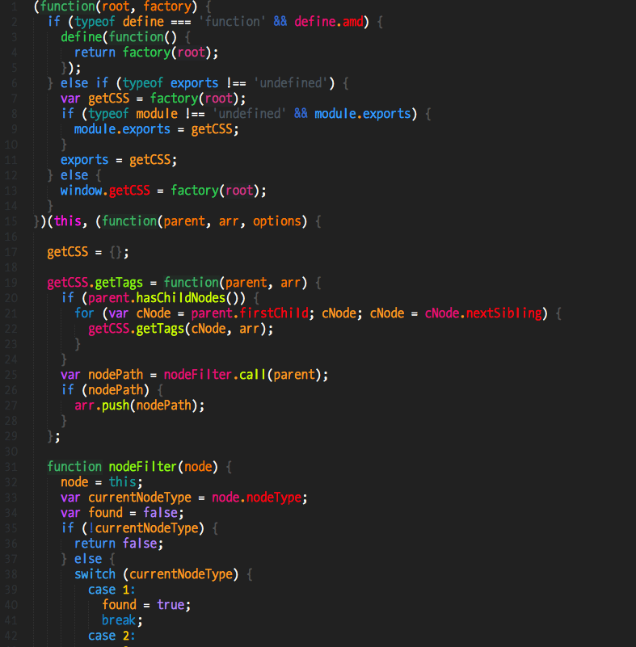

#mod-monokai-js.tmTheme

SublimeText JavaScript Theme for use with [Babel](https://packagecontrol.io/packages/Babel)

##Instructions:

* Install Babel ES6 defintions @ https://packagecontrol.io/packages/Babel
* Download theme and place in `~/Library/Application Support/Sublime Text 3/Packages/User`
or another place of your choosing.
* Change `.js` file syntax to `JavaScript (Babel)` and make `mod-monokai-js.tmTheme` the default
theme.

##ColorGuide:

`Green-ish:` Functions and methods.

`Orange:` Variables.

`Pink`: Objects.
